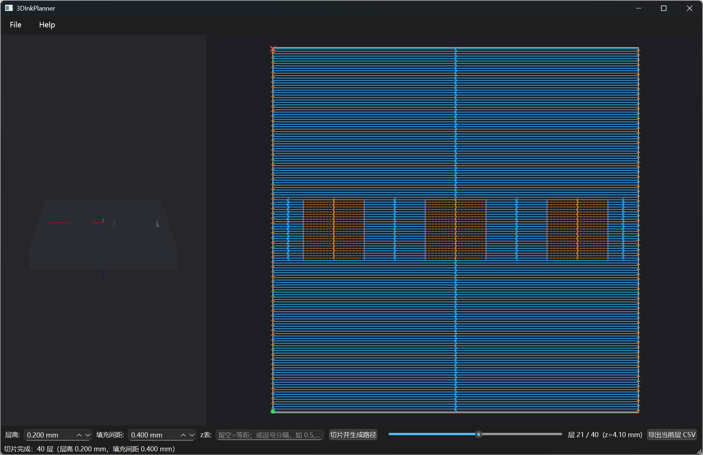

# 3D Ink Planner

**[中文文档](README.zh-CN.md)**

   

A desktop pre-processing and toolpath planning application for 3D inkjet printing, built from scratch with C++17 / Qt6 / OpenGL / Eigen. It covers the full pipeline: **STL import → mesh topology validation → layer slicing → 2D contour reconstruction → scan-fill toolpath generation → G-code / CSV export**.

The project emphasizes **layered architecture** and **testable geometry/path algorithms** — the core engine is a pure C++ static library with zero Qt dependencies, fully testable headless.



*Left: OpenGL 3D model view. Right: 2D layer preview — blue solid = print segments (serpentine fill with holes automatically excluded), orange dashed = travel moves, purple = hole inner rings. Bottom: layer slider and export controls.*

## Features

- **STL import (Binary/ASCII auto-detection)**: header/triangle-count validation, bounding box computation; face normals recomputed from winding order (immune to broken normal fields)
- **Mesh topology health check**: O(n) spatial-hashing vertex welding, manifold/boundary/non-manifold edge statistics, connected components, signed-volume validation, BFS-based normal consistency repair
- **OpenGL 3D viewer**: orbital camera (rotate/pan/zoom), Lambert lighting, coordinate axes
- **Layer slicing**: triangle–plane intersection with half-open interval rule; sweep-line active-set acceleration + multithreaded layer partitioning (parallel output is bit-identical to serial)
- **Contour reconstruction**: O(n) endpoint-hash stitching into ordered contours, T-junction minimum-turn selection, explicit open-chain warnings
- **Inner/outer ring classification**: ray-casting containment for hole detection, inner rings paired with smallest-area parent, direction normalization (outer CCW / inner CW)
- **Scan-fill toolpaths**: equidistant scanlines + even-odd pairing (holes excluded naturally) + serpentine ordering; nearest-neighbor island sequencing with travel-move insertion and print/travel length statistics
- **G-code-like & CSV export**: per-layer CSV (index,x,y,z,type) or full-stack G-code (G0 travel / G1 print / layer Z lifts)
- **Variable layer thickness**: explicit Z-height table input, layers outside (zMin, zMax) are skipped explicitly

## Architecture

```text
app/        MainWindow          UI orchestration only (no geometry algorithms)
widgets/    SliceView           2D layer preview (QPainter)
graphics/   GLWidget / Camera / MeshRenderer / Shader   OpenGL 3D rendering
------------ UI layer (Qt6) ------------
geometry/   GeometryTypes / Polyline / Polygon / Transform
io/         STLReader / PathExporter (CSV & G-code)
topology/   IndexedMesh / MeshBuilder (health check & repair)
slicing/    Slicer / TrianglePlaneIntersection / SegmentConnector
            / ContourBuilder / ContourClassifier
path/       RasterFillGenerator / PathOptimizer
------------ core library 3DInkPlannerCore (pure C++17 + Eigen, no Qt) ------------
tests/      11 CTest suites, custom zero-dependency assertions
bench/      bench_pipeline (performance regression tool)
```

## Core Algorithms

1. **Triangle–plane intersection**: edge endpoints are classified against the slice plane; edges crossing with a half-open rule emit exactly one point each, so mesh vertices shared by triangles are never double-counted.
2. **O(n) contour stitching**: unordered segments are chained by endpoint hashing; at T-junctions the minimum-turn continuation wins; unclosed chains are reported explicitly instead of being silently discarded.
3. **Hole classification**: ray-casting containment count decides outer vs. inner rings (no area heuristics); inner rings attach to their smallest-area parent outer ring.
4. **Sweep-line slicing**: triangles sorted by zMin are activated/expired as layers ascend — only the active set is intersected. Complexity drops from O(L·F) to O((F+L)·k). Slicing a 130K-face sphere went from 317 ms to 41 ms.
5. **Multithreaded slicing**: layers are statically partitioned into contiguous ranges; each thread runs an independent sweep line and writes pre-allocated result slots — lock-free, no shared writes, and **bit-identical to serial output** (cross-validated in tests). An atomic work-stealing variant was benchmarked and rejected: per-chunk sweep-line reconstruction cost exceeded the load-balancing gain.
6. **Scan fill**: scanlines intersect outer + hole rings together and pair intersections by the even-odd rule (holes excluded without boolean ops); serpentine row ordering minimizes travel distance.
7. **Path optimization**: islands are sequenced by nearest-neighbor greedy search; travel moves are inserted at discontinuities so each layer becomes a fully continuous print/travel sequence with length statistics.

## Performance

`bench_pipeline.exe <stl> [layerHeight] [spacing]` (Release, 20 threads):

| Model | Faces | Layers | Parse | Slicing (parallel / serial) | Toolpath | Total |
|---|---|---|---|---|---|---|
| sphere_r30_131k.stl (0.5 mm) | 130,560 | 120 | 45 ms | **28 ms** / 98 ms (3.5×) | 12 ms | **84 ms** |
| sphere_r30_131k.stl (0.2 mm) | 130,560 | 300 | 43 ms | **42 ms** / 237 ms (5.7×) | 30 ms | **114 ms** |

Slicing evolution: brute force 317 ms → sweep-line 41 ms → multithreaded 28 ms (120 layers). Higher layer counts amortize thread startup better (5.7× at 300 layers).

## Build & Run

Requirements: CMake ≥ 3.21, Qt ≥ 6.4 (Widgets/OpenGL/OpenGLWidgets), Eigen 3.4 (header-only), a C++17 compiler.

```bash
cmake -S . -B build -DCMAKE_PREFIX_PATH=<Qt6 path> -DEIGEN3_INCLUDE_DIR=<Eigen path>
cmake --build build --config Release
ctest --test-dir build -C Release --output-on-failure
```

Run: `3DInkPlanner.exe <model.stl>` — sample models are in `assets/models/`.

## Testing

11 CTest suites covering: STL reading (binary/ASCII auto-detection), triangle–plane intersection, segment stitching (open-chain / T-junction warnings), slicing (sweep-line vs. per-layer consistency, parallel-vs-serial bit-identical consistency, coplanar warnings), ring classification, scan fill (hole exclusion), path optimization, coordinate transform (adaptive tolerance), CSV & G-code export, sample-asset integration, and topology building. All use a custom zero-dependency assertion style — no external test framework.

## Known Limitations

- Triangles **coplanar** with a slice plane are ignored with an explicit warning (2D boolean completion is future work); avoiding slice heights exactly at horizontal faces works around it
- Non-manifold / boundary edges are **reported, not repaired**; open chains are shown as red dashed lines in preview and excluded from fill
- PathOptimizer uses nearest-neighbor greedy sequencing (no 2-opt global refinement)
- G-code-like export is a simplified instruction stream (no extrusion/temperature/speed process parameters) — for pipeline demonstration, not direct machine control
- Coordinate transform supports uniform scale + Z-axis rotation only

## License

MIT — see [LICENSE](LICENSE).
